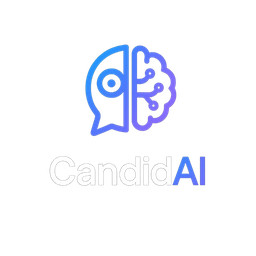
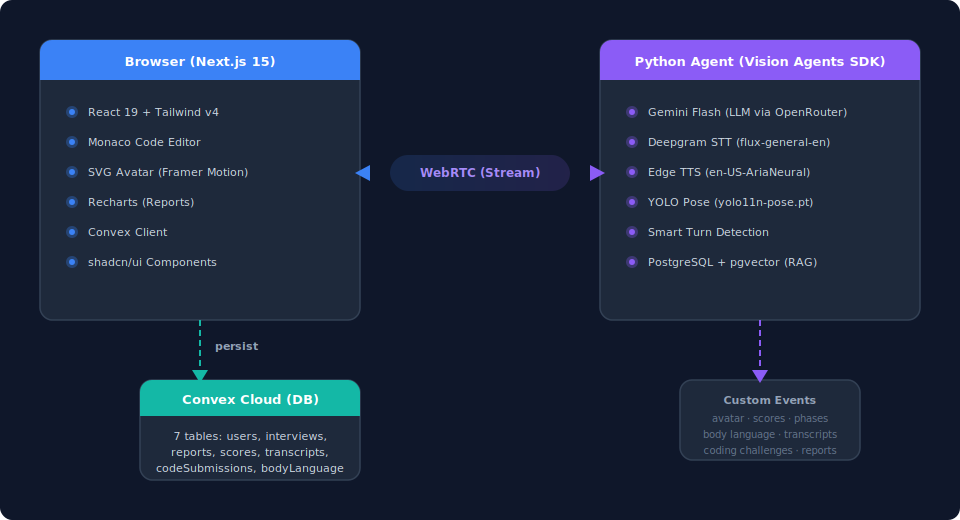
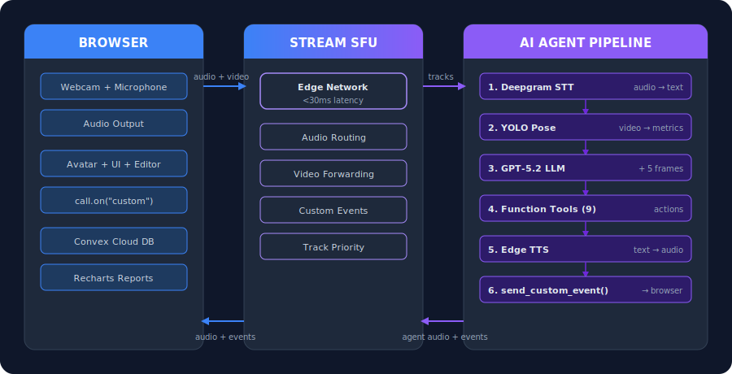
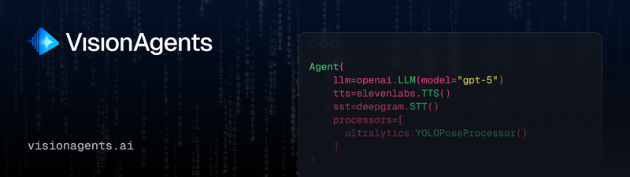

<p align="center">
  
</p>

<h1 align="center">CandidAI</h1>

<p align="center">
  <b>AI-powered technical interviews with real-time body language analysis, live coding challenges, and comprehensive performance reports.</b>
</p>

<p align="center">
  
  
  
  
  
</p>

---

## TL;DR

**Problem:** Mock interviews are expensive, lack real-time feedback, and can't assess non-verbal communication.

**Solution:** CandidAI deploys an AI interviewer agent that conducts realistic technical interviews over WebRTC, tracks body language via YOLO pose estimation, evaluates live code submissions, and generates detailed performance reports — all in a single session.

| Feature | What It Does |
|---------|-------------|
| AI Interviewer | Adaptive multi-phase interview (intro, behavioral, technical, coding, wrap-up) powered by OpenAI GPT-5.2 with vision |
| Body Language Analysis | Real-time posture, fidgeting, and eye-contact tracking via YOLO pose estimation |
| Live Coding | Monaco editor with language-aware challenges, AI-evaluated submissions |
| Performance Reports | Radar charts across 5 dimensions, timestamped transcript, integrity review |
| Anti-Cheat Monitoring | Automated suspicious behavior flagging with severity scoring |
| Animated Avatar | SVG interviewer avatar with 10 expressions, lip sync, and head nods |

---

## Architecture

<p align="center">
  
</p>

The browser connects to the Python agent over **WebRTC** via Stream's edge network. The agent sends custom events for avatar control, transcript updates, phase transitions, score updates, coding challenges, and body language metrics. The frontend persists all data to Convex in real-time.

### Data Flow

<p align="center">
  
</p>

---

## Tech Stack

| Layer | Technology |
|-------|-----------|
| **LLM** | OpenAI GPT-5.2 (vision + function calling via ChatCompletionsVLM) |
| **STT** | Deepgram (`flux-general-en`) |
| **TTS** | Edge TTS (free Microsoft neural, `en-US-AriaNeural`) |
| **Turn Detection** | Deepgram endpointing (or Smart Turn Detection optional) |
| **Pose Estimation** | YOLO (`yolo11n-pose.pt`) via Ultralytics |
| **Transport** | Stream Video SDK + Vision Agents SDK (WebRTC) |
| **Frontend** | Next.js 15, React 19, Tailwind CSS v4, shadcn/ui, Framer Motion |
| **Backend DB** | Convex Cloud (7 tables, auto-generated TypeScript types) |
| **Code Editor** | Monaco Editor (`@monaco-editor/react`) |
| **Charts** | Recharts (RadarChart) |
| **RAG** | PostgreSQL + pgvector, fastembed (`BAAI/bge-small-en-v1.5`) |
| **Deploy** | Docker Compose (PostgreSQL + Agent + Web) |

---

## Quick Start

### Prerequisites

- Node.js 18+
- Python 3.12+
- Docker & Docker Compose
- API keys (see [Environment Variables](#environment-variables))

### 1. Clone & Install

```bash
git clone https://github.com/aryan877/candidai.git
cd candidai

# Frontend
cd web && npm install

# Agent
cd ../agent && uv sync
```

### 2. Set Up Environment

```bash
# Frontend
cp web/.env-example.local web/.env.local
# Fill in: CONVEX_DEPLOYMENT, NEXT_PUBLIC_CONVEX_URL,
#          NEXT_PUBLIC_STREAM_API_KEY, STREAM_API_SECRET

# Agent
cp agent/.env.example agent/.env
# Fill in: OPENROUTER_API_KEY, STREAM_API_KEY, STREAM_API_SECRET,
#          DEEPGRAM_API_KEY, ELEVENLABS_API_KEY, DATABASE_URL
```

### 3. Run

**Option A: Docker Compose (recommended)**
```bash
# Development (hot reload, postgres included)
docker compose -f docker-compose.dev.yml up

# Production
docker compose up
```

**Option B: Local development**
```bash
# Terminal 1 — Database
docker run -d --name candidai-pg -p 5432:5432 \
  -e POSTGRES_PASSWORD=candidai pgvector/pgvector:pg16

# Terminal 2 — Convex
cd web && npx convex dev

# Terminal 3 — Frontend
cd web && npm run dev

# Terminal 4 — Agent
cd agent && uv run python main.py serve --host 0.0.0.0 --port 8765
```

### 4. Use

1. Open `http://localhost:3000`
2. Sign in (admin: `admin@candidai.dev`)
3. Create an interview session from the dashboard
4. Share the interview URL or join directly
5. After the interview, view the detailed report

---

## Project Structure

```
candidai/
├── agent/                     # Python backend (Vision Agents SDK)
│   ├── main.py                # Entry point: Runner + AgentLauncher CLI
│   ├── candidai_agent.py      # Agent factory, 8 function tools, event wiring
│   ├── pose_processor.py      # YOLO pose → body language metrics
│   ├── events.py              # Custom PluginBaseEvent definitions
│   ├── instructions.md        # System prompt (5-phase interview flow)
│   ├── interview_questions/   # RAG knowledge base
│   ├── pg_rag.py              # PostgreSQL + pgvector RAG engine
│   └── Dockerfile
│
├── web/                       # Next.js frontend
│   ├── convex/                # Convex backend (schema, mutations, queries)
│   ├── src/
│   │   ├── app/               # Pages: landing, sign-in, dashboard,
│   │   │                      #   interview/[id], report/[id], admin
│   │   ├── components/
│   │   │   ├── avatar/        # SVG avatar + 10 expressions + animations
│   │   │   ├── interview/     # Room, Header, Controls, Transcript, BodyLanguage
│   │   │   ├── editor/        # Monaco CodeEditor + CodeOutput
│   │   │   ├── report/        # Dashboard, ScoreRadar, Timeline, Recording
│   │   │   ├── auth/          # SignInForm, AuthGuard
│   │   │   └── ui/            # shadcn/ui components + glass-card
│   │   ├── types/             # TypeScript interfaces for all events
│   │   └── lib/               # Constants, utilities
│   └── public/                # Logo, favicon, feature icons
│
├── docker-compose.yml         # Production: postgres + agent + web
├── docker-compose.dev.yml     # Development with hot reload
└── .env.example               # Required API keys template
```

---

## Features

### AI Interviewer Agent

The agent uses 8 function tools to orchestrate the interview:

| Tool | Purpose |
|------|---------|
| `set_expression` | Control avatar facial expressions (10 types) |
| `nod_head` | Trigger head nod animation |
| `raise_eyebrows` | Trigger eyebrow raise animation |
| `score_response` | Score candidate on 5 dimensions (0-10) |
| `present_coding_challenge` | Send coding problem with starter code |
| `evaluate_code` | AI-evaluate submitted code |
| `transition_phase` | Move to next interview phase |
| `generate_report` | Create final interview report |

### Interview Phases

`intro` → `behavioral` → `technical` → `coding` → `wrapup`

Each phase adapts questions based on candidate responses using RAG-powered question retrieval from a curated knowledge base.

### Scoring Dimensions

| Dimension | What's Measured |
|-----------|----------------|
| Communication | Clarity, articulation, structured thinking |
| Problem Solving | Analytical approach, edge case handling |
| Technical Knowledge | Domain expertise, concept understanding |
| Code Quality | Clean code, efficiency, best practices |
| Behavioral | Professionalism, teamwork, growth mindset |

---

## Environment Variables

### Frontend (`web/.env.local`)

| Variable | Description |
|----------|-------------|
| `CONVEX_DEPLOYMENT` | Convex deployment identifier |
| `NEXT_PUBLIC_CONVEX_URL` | Convex public URL |
| `NEXT_PUBLIC_STREAM_API_KEY` | Stream Video API key (public) |
| `STREAM_API_SECRET` | Stream Video API secret |
| `ADMIN_EMAIL` | Admin account email (default: `admin@candidai.dev`) |

### Agent (`agent/.env`)

| Variable | Description |
|----------|-------------|
| `OPENAI_API_KEY` | OpenAI API key (for GPT-5.2 vision) |
| `STREAM_API_KEY` | Stream Video API key |
| `STREAM_API_SECRET` | Stream Video API secret |
| `DEEPGRAM_API_KEY` | Deepgram STT API key (speech-to-text) |
| `DATABASE_URL` | PostgreSQL connection string (for pgvector RAG) |
| `EDGE_TTS_VOICE` | Microsoft Edge TTS voice (default: `en-US-AriaNeural`) |

---

## Custom Events

Real-time communication between agent and frontend via Stream Video custom events:

| Event | Direction | Payload |
|-------|-----------|---------|
| `avatar_expression` | Agent → Web | `{expression, intensity}` |
| `avatar_action` | Agent → Web | `{action, speed}` |
| `interview_phase` | Agent → Web | `{phase}` |
| `speech_transcription` | Agent → Web | `{speaker, text}` |
| `body_language` | Agent → Web | `{posture, fidgeting, eye_contact}` |
| `score_update` | Agent → Web | `{dimension, score, feedback}` |
| `coding_challenge` | Agent → Web | `{title, description, language, starter_code}` |
| `code_evaluation` | Agent → Web | `{passed, feedback, score}` |
| `final_report` | Agent → Web | `{overall_score, recommendation, strengths, improvements}` |
| `code_submission` | Web → Agent | `{code, language, challengeTitle}` |

---

## Troubleshooting

<details>
<summary><b>Agent fails to connect to interview</b></summary>

**Cause:** Agent server not running or wrong port.

**Fix:**
```bash
# Verify agent is running
curl http://localhost:8765/health

# Check STREAM_API_KEY and STREAM_API_SECRET match between web and agent
```
</details>

<details>
<summary><b>Body language metrics show 0 for all values</b></summary>

**Cause:** YOLO model not warming up or camera feed not reaching agent.

**Fix:**
```bash
# Ensure camera permissions are granted in browser
# Check agent logs for YOLO initialization
docker logs candidai-agent 2>&1 | grep -i yolo
```
</details>

<details>
<summary><b>Convex "table not found" errors</b></summary>

**Cause:** Schema not deployed.

**Fix:**
```bash
cd web && npx convex dev
# Wait for schema push to complete
```
</details>

<details>
<summary><b>"Token failed" when joining interview</b></summary>

**Cause:** Stream API credentials mismatch.

**Fix:** Ensure `NEXT_PUBLIC_STREAM_API_KEY` in `web/.env.local` matches `STREAM_API_KEY` in `agent/.env`, and both secrets match.
</details>

---

## Limitations

| Limitation | Workaround |
|------------|------------|
| Single concurrent interview per agent instance | Scale with multiple agent containers |
| YOLO pose requires camera feed | Audio-only mode available (no body language) |
| RAG knowledge base is static | Extend `interview_questions/` directory |
| English-only STT model | Switch Deepgram model for other languages |

---

## Built With

<p align="center">
  
</p>

<p align="center">
  Built for the <b>Vision Possible: Agent Protocol</b> hackathon using the
  <a href="https://visionagents.ai">Vision Agents SDK</a> by Stream.
</p>

---

<p align="center">
  <sub>Made with caffeine and curiosity.</sub>
</p>
